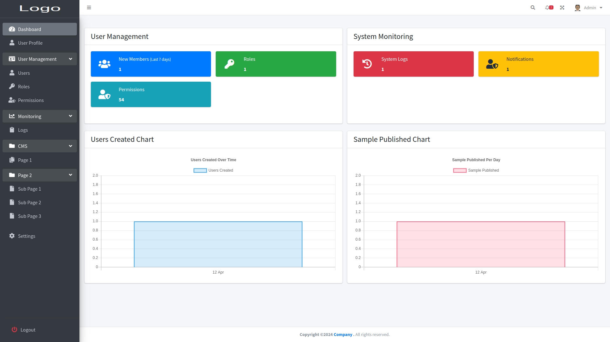

# Laravel Template for Final Year Project (LTP) - Starter Kit 

## Introduction
Welcome to the Laravel Template for Final Year Project (LTP)! This template is designed to serve as a starting point for developers embarking on their final year projects. It comes with pre-implemented modules to streamline development and accelerate the process.

## Features
The LTP includes the following pre-implemented modules:

1. **Authentication Module**:
   - Enables users to register and log in to the system using their email and password.
   - Provides functionality to update user profiles after login.

2. **User Management Module**:
   - Manages users, roles, and permissions.
   - Users: Contains a list of users stored in the database.
   - Roles: Defines roles such as admin and editor.
   - Permissions: Stores permissions necessary for specific roles, based on routes defined in `web.php`.
   - Access restricted to admin role.

3. **System Monitoring Module**:
   - Basic system monitoring tracks events performed in the system.
   - CRUD (Create, Read, Update, Delete) events are logged in the database.
   - Logs are retrieved and displayed in the admin dashboard for system monitoring.

4. **Content Management Module**:
   - Provides templates for additional pages in the system.
   - Includes page1 and page2, with page2 containing CRUD views (index, create, edit, form, show).
   - Form fields are designed to reduce redundancy in create and edit pages.

## Integration
- Integrated with adminLTE layout for a user-friendly interface.
- Utilizes Laravel Sail for Docker container usage, simplifying development environment setup.

## Getting Started
To get started with the LTP template, follow these steps:

1. **Setup Development Environment**:
   - Install XAMPP, Composer, and a text editor like VSCode or Sublime.

2. **Configure Database**:
   - Open the `.env` file in the project.
   - Locate the `DB_DATABASE=` section and set the database name. By default, it's set to `ltp`. You can change it to your preferred name or create the database with the provided name in your database engine (e.g., phpMyAdmin).

3. **Run Commands**:
   ```bash
   php artisan key:generate
   php artisan migrate
   php artisan permission:create-permission-routes
   php artisan db:seed --class=DatabaseSeeder
   php artisan storage:link
   php artisan serve --port=8081


4. **Login Credentials**:
- Email: admin@company.com
- Password: admin123

5. **Explore and Enjoy**:
- After logging in with the provided credentials, you'll be redirected to the admin dashboard. Start exploring and coding!

## Troubleshooting
If you encounter any errors, try running the following commands:

   ```bash
    php artisan cache:clear
    php artisan config:clear
    php artisan route:clear
    php artisan view:clear
   ```
   
If you're using Laravel Sail, replace `php` with `sail` in the commands.

AMA: sjwmatiko.dev@gmail.com

Happy coding with LTP! 😊🚀
